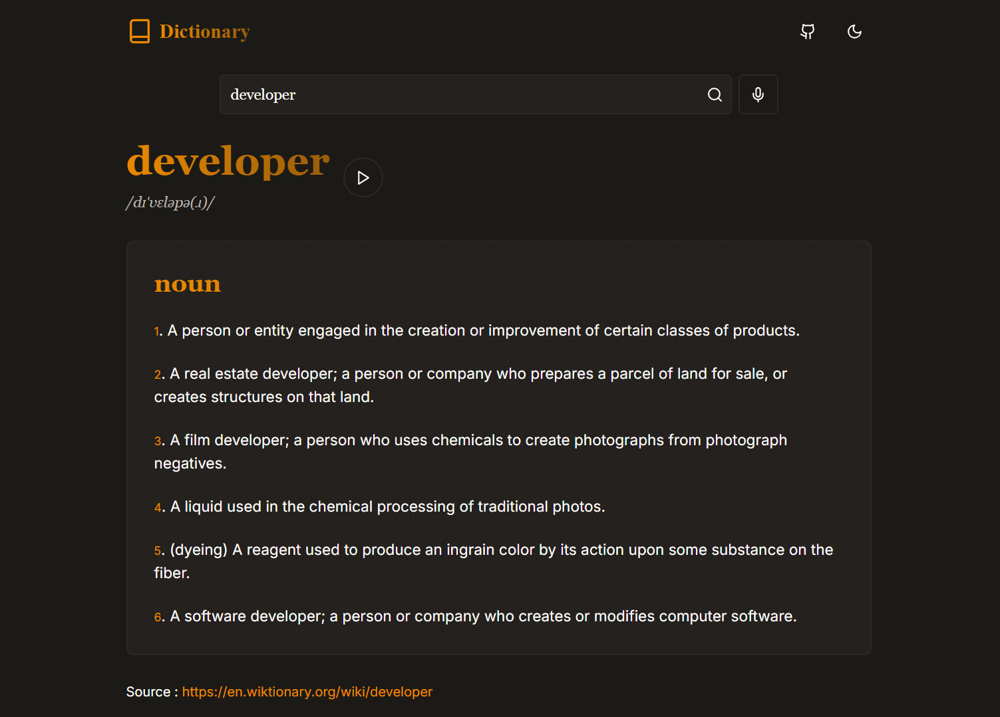

# 📜 Manuscript Dictionary App

A beautifully crafted, manuscript-themed dictionary app built using **Next.js**, **TypeScript**, and **Tailwind CSS**. This app combines functionality with aesthetics, delivering an immersive experience for word enthusiasts.

## 🌟 Features

- **Elegant Manuscript Theme**: A unique, visually appealing interface inspired by classic manuscripts.
- **Word Search**: Easily search for the meanings, synonyms, and origins of words.
- **Responsive Design**: Fully responsive for seamless use on any device.
- **Dark Mode**: A soothing dark mode for nighttime browsing.
- **Interactive UI**: Intuitive navigation for an enhanced user experience.

## 🎨 Technologies Used

- **Next.js**: For building a fast, server-rendered React application.
- **TypeScript**: Ensuring robust and type-safe code.
- **Tailwind CSS**: For crafting beautiful, responsive styles effortlessly.

## 📷 Preview

---

Feel free to explore the wonders of words with a touch of elegance. ✨